# WREN: Low-Light-Image-Enhancement-Guided-By-Retinex-Theory

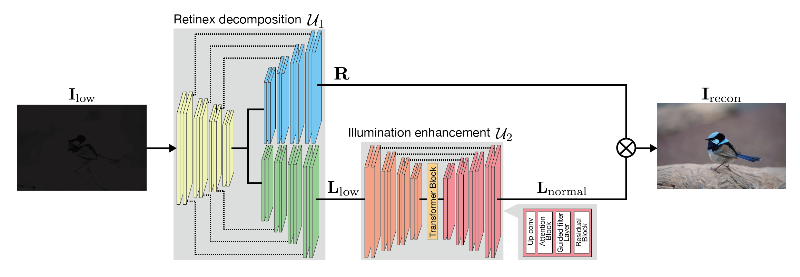

This is a low-light image enhancement guided by Retinex theory (WREN). Our network achieves the state-of-the-art performance on both distortion-based and structural metrics when trained on a single training dataset.

### Usage in command line
Git clone this repo, then do either 

```pip install -r requirements.txt.```

## Testing
Download our model checkpoint from [Google Drive](https://drive.google.com/drive/folders/1ct4pMvvHBVzA2u0XKK-XZBXIKaDSQg1Y?usp=sharing). Put them in a folder. Our method can be quickly used with this command.

``` python3 WREN_test.py --data input/your_testdata --weights retinex_e2e_best_test_gf.pth --out your_output_folder ```

## Training
If you want to retrain our network, please use this command. Please change the input dataset for your training dataset in WREN_train.py.

``` python3 WREN_train.py ```


## Benchmarking Results on Synthesized Images
The following tables are the current state-of-the-art results for low light image enhancement. The average PSNRs/SSIMs are computed over the test datasets.

### Experimental Results (Average PSNRs and SSIMs in several datasets)
|Method   | PSNR  | SSIM  |
|---|---|---|
|Retinexformer ([Y Cai et al.](https://github.com/caiyuanhao1998/Retinexformer))   |17.022   | 0.742  |
|RetinexNet ([C Wei et al.](https://github.com/weichen582/RetinexNet))   |15.105  | 0.790  |
|SNR-Net ([X Xu et al.](https://github.com/dvlab-research/SNR-Aware-Low-Light-Enhance))   |16.106  | 0.709  |
|WREN | **18.222**  | **0.814**  |

### Visualizing results
| Input | WREN  | Retinexformer  | RetinexNet| SNR-Net|
|---|---|---|---|---|
| 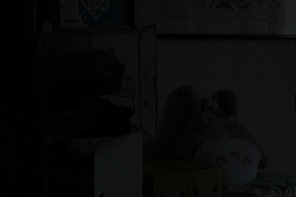 | 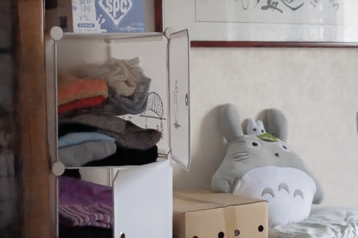 | 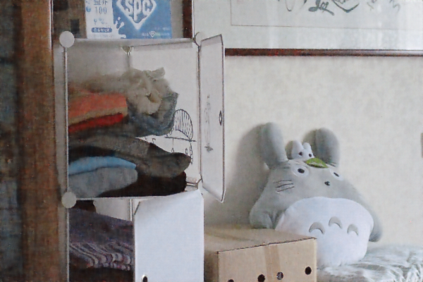 |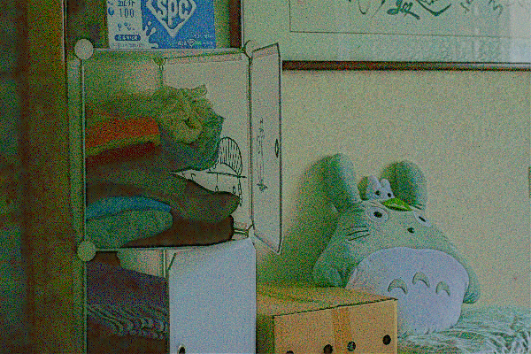 |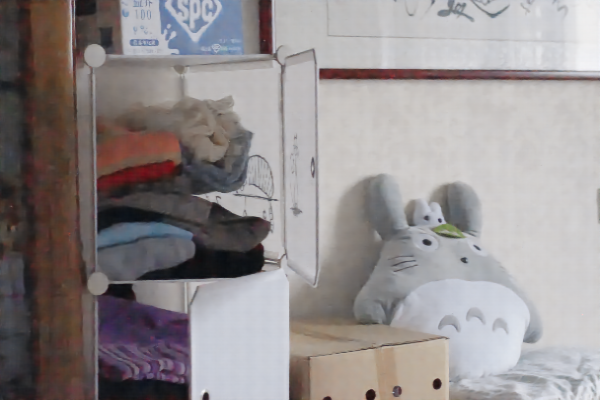 |
| 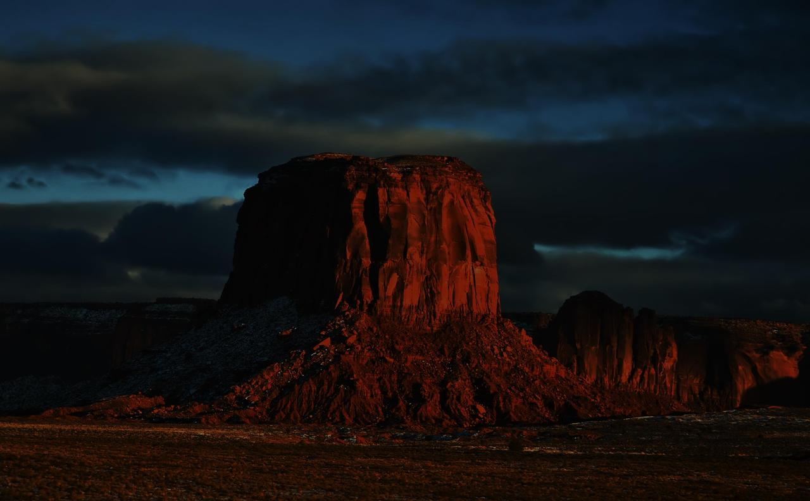 |  |  |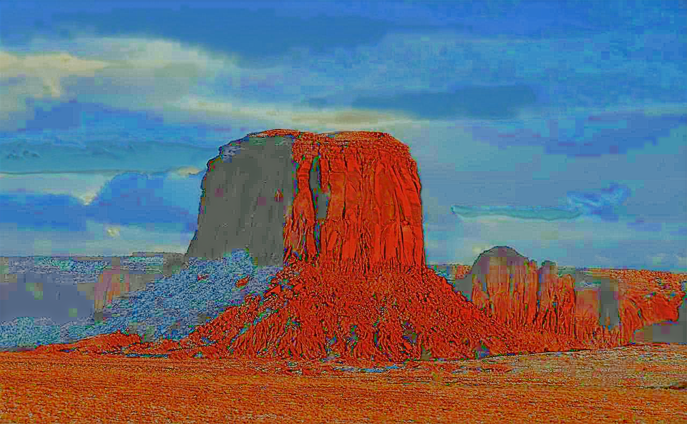 | |
| 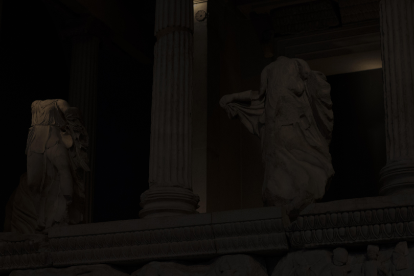 | 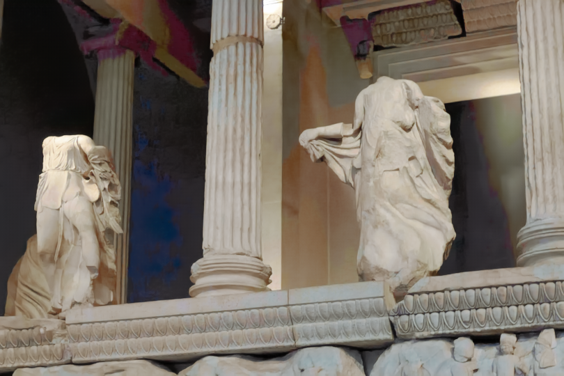 |  | | |
| 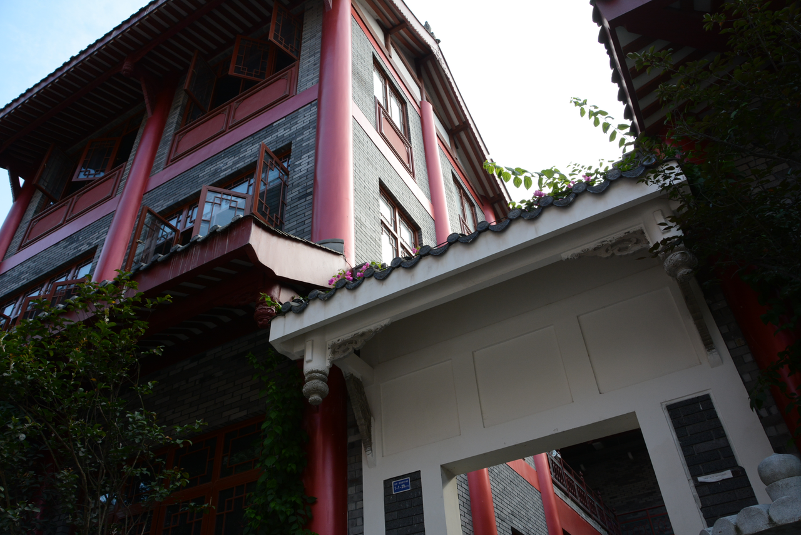 | 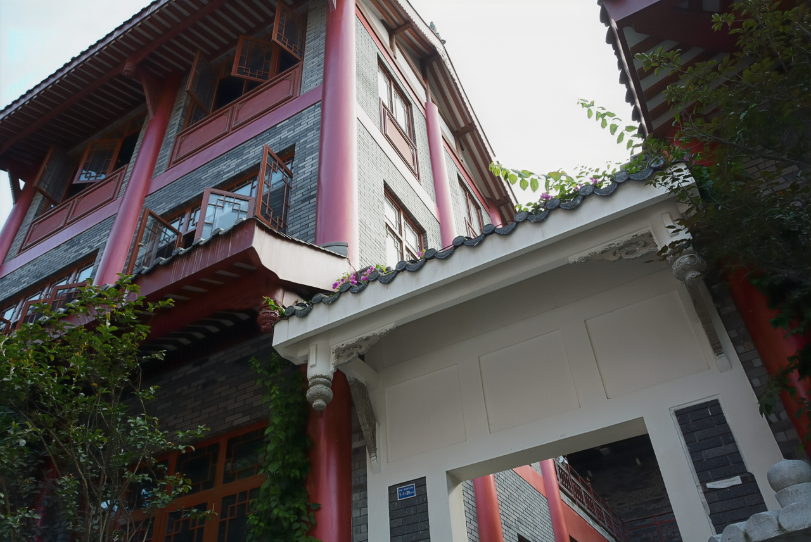 | 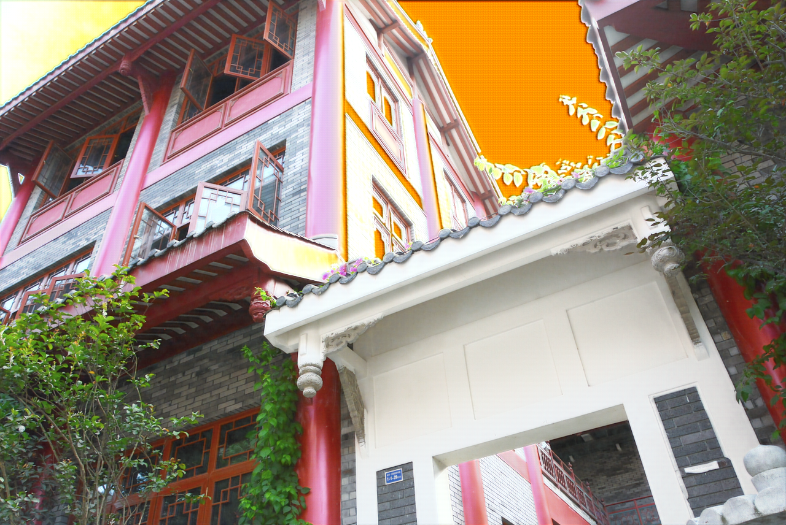 |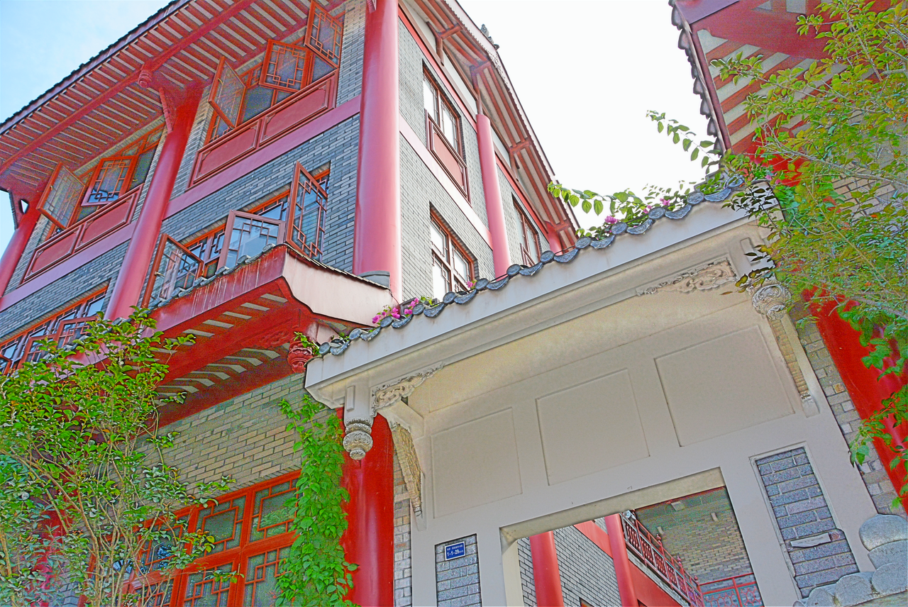 |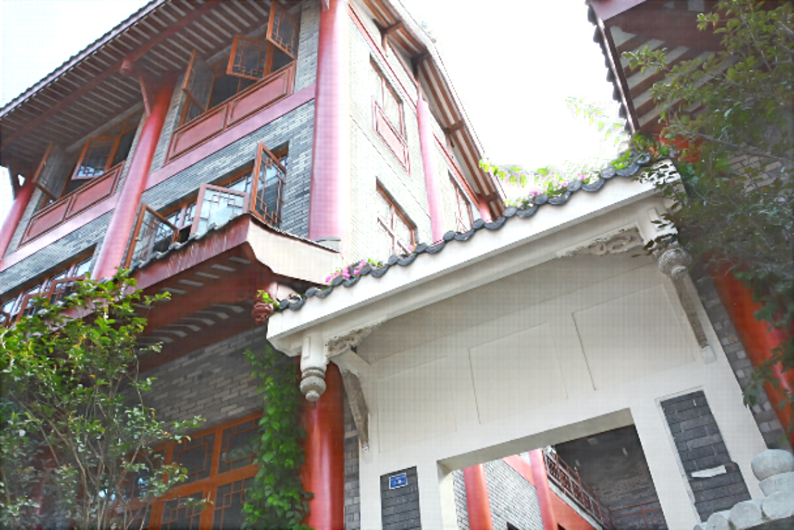 |
| 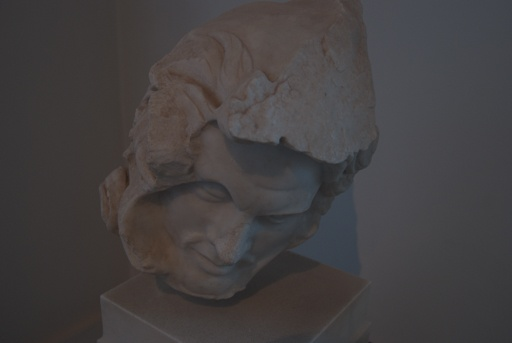 | 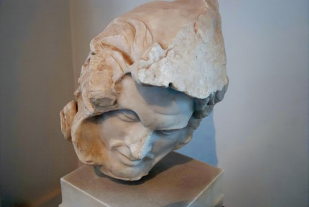 | 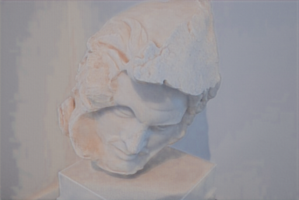 |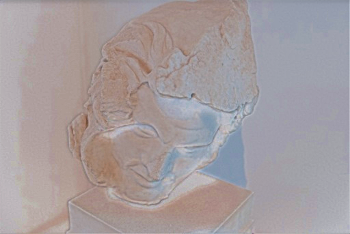 |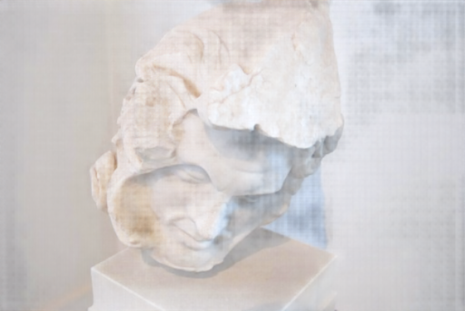 |
